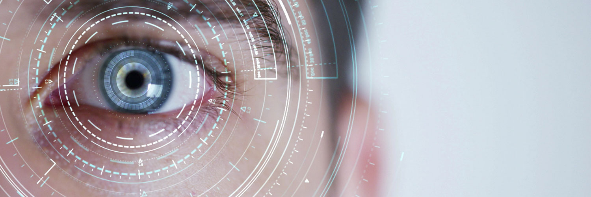

# eyegaze to screen
My personal code in development about eyetracking.

   

  

# Flavio Salazar
*Full Stack Developer*

Description

  This repository is focused on using OpenCV for eyetracking research.The main goal is to accurately track the position of the eyes and head,
  converting that information into a position on a screen.  The software is still under development, but has shown promising results so far.
  I have the intention to convert this layout with something more friendly to use as a future application.
  
  As soon as possible I gonna be writing an article talking about specially of mediapipe!
  
  **To run this draft, just install the requirements (notice that I'm using Python3.8), and when the program runs, look into to each dot and click over it. When you mark the nine dots, press the button "Click Me" and then it's gonna start to draw a dot that represents where you are looking at.**

**Background in:** Python with OpenCV, Mediapipe, Pandas and Numpy

**Links:**
* [LinkedIn](https://www.linkedin.com/in/flavio-r-salazar)

---

